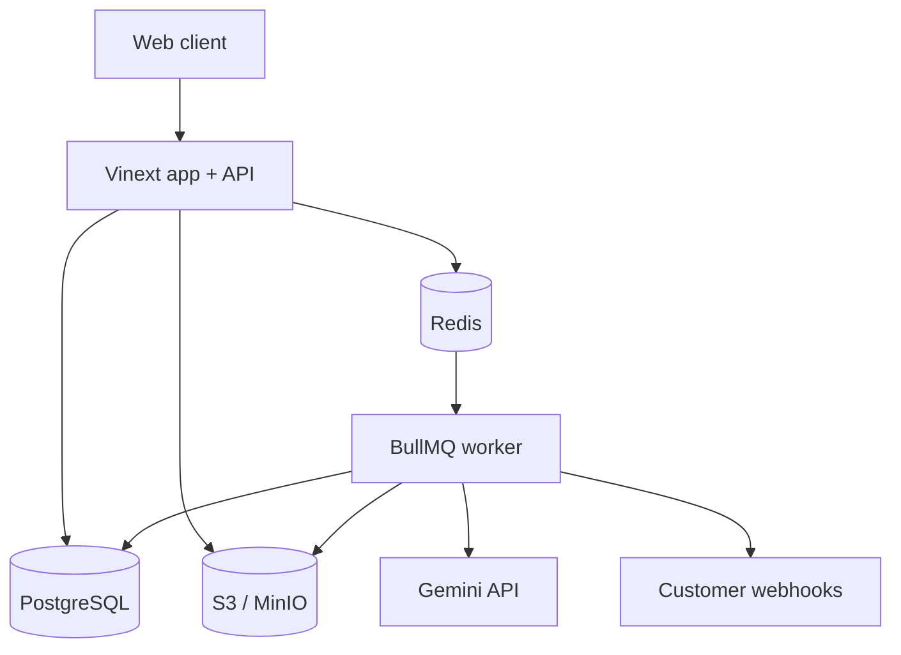
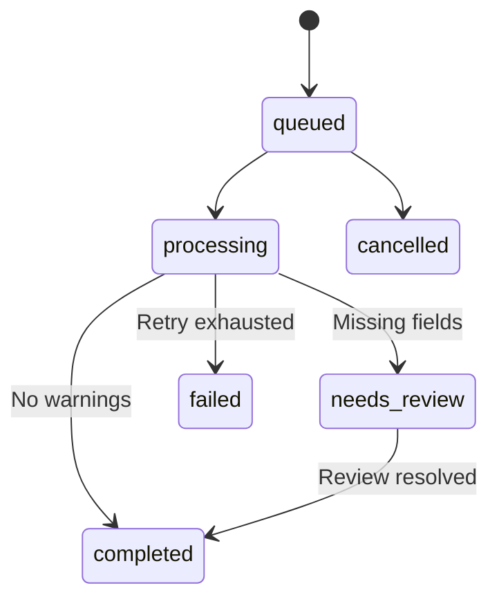

# Architecture

## Runtime topology

## Data ownership

- User belongs to one or more workspaces through `workspace_members`.
- Templates, Jobs, API keys, webhook endpoints, credits and audit logs are workspace-scoped.
- Job metadata and normalized rows live in PostgreSQL.
- Original files live in S3-compatible object storage.
- Redis holds transient queue state only.

## Job lifecycle

The API uploads every source file before enqueueing a job. The worker processes files sequentially inside a job while multiple jobs can run concurrently. BullMQ retries failed jobs three times with exponential backoff.

## Local fallback

When `DATABASE_URL` or `AUTH_SECRET` is absent, `/api/session` reports local mode. The browser keeps Gemini credentials in session storage and stores results/templates in local storage. This preserves the zero-infrastructure prototype workflow.
